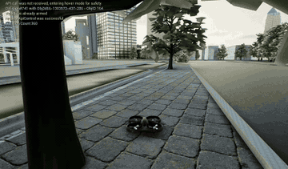

# 🦅 AerialClaw: Towards Personal AI Agents for General Autonomous Aerial Systems


<p>
  
  
  
  
  
  
</p>

**English** | [中文](README_CN.md)

**AerialClaw** is a personal AI agent framework for general autonomous aerial systems. The system provides a standardized library of atomic action skills (takeoff, navigation, perception, etc.), with an LLM performing real-time environmental perception, decision planning, and skill composition during task execution — eliminating the need to pre-script complete flight procedures for each mission, while endowing each drone with its own identity, task memory, and skill evolution capability.

The project uses Markdown documents to define and maintain each agent's cognitive state and capability boundaries, autonomously read and written by the model — making every drone truly "personal" with its own experience, preferences, and growth trajectory.

> *"No pre-scripted procedures, just defined capabilities — let every drone think, learn, and grow through its own missions."*

<p align="center">
  
</p>

---
---
---

## 📢 Update

- **(2026/3/24)** AerialClaw v2.0 updated — safety envelope, four-layer memory, universal device protocol, self-evolution engine, AirSim Shanghai city scene, autonomous city patrol demo, GPT-4o vision perception, real-time map update, Doctor agent adapter, WASD manual control, smooth interpolated flight.
- **(2026/3/14)** AerialClaw v1.0 released — full agent loop, 12 hard skills, reflection engine, Web UI, PX4+Gazebo simulation.


## 📑 Table of Contents

- [Motivation](#motivation)
- [System Architecture Design](#system-architecture-design)
- [Decision Mechanism](#decision-mechanism-autonomous-loop-implementation)
- [Skill System](#integrated-skill-system)
- [Perception System](#perception-system)
- [Simulation Environment](#simulation-verification-environment)
- [Web Monitoring Interface](#web-monitoring-interface)
- [Installation and Deployment](#installation-and-deployment)
- [Quick Start](#quick-start)
- [Project Structure](#project-structure)
- [Acknowledgements](#acknowledgements)

## Motivation

Current drone systems mostly rely on pre-programmed scripts, lacking adaptability to unknown environments. AerialClaw explores endowing drones with **autonomous environmental understanding and real-time decision-making** through LLMs:

- 🧠 **Reasoning, not just execution** — LLM parses task objectives and generates step-by-step decisions
- 👁️ **Semantic-level understanding** — Multi-source sensor data converted to natural language for commonsense reasoning
- 📝 **Flight experience accumulation** — Task memory repository for history-based decision optimization
- 🪪 **Capability boundary awareness** — Performance profiles tracking capability boundaries

## System Architecture Design

<p align="center">
  
</p>

### Core Design Principles

1. **First-person decision perspective** — Drone's own perspective for decision-making
2. **Semantic-level sensor fusion** — Raw sensor data converted to LLM-understandable descriptions
3. **Document-driven skill definition** — Actions and strategies as readable documents, dynamically loaded
4. **Hierarchical memory management** — Long-term experience and short-term context balanced efficiently

## Decision Mechanism: Autonomous Loop Implementation

The system employs an incremental decision mechanism based on real-time perception, executing a complete cognitive cycle at each step:

<p align="center">
  
</p>

The system possesses basic exception handling capabilities: path replanning when obstructed, attention adjustment when discovering unexpected targets, and automatic return when battery is low.

### Identity and State Management System

| Document | Functional Description | Content Example |
|----------|-----------------------|-----------------|
| `SOUL.md` | Defines decision preferences and constraints | *Safety-first strategy, conservative risk assessment* |
| `BODY.md` | Records hardware configuration and performance parameters | *Sensor types, flight performance boundaries* |
| `MEMORY.md` | Stores task experience and lessons learned | *Effective strategy records for specific scenarios* |
| `SKILLS.md` | Tracks skill execution statistics | *Success rates and applicable conditions for actions* |
| `WORLD_MAP.md` | Builds environmental feature knowledge base | *Landmarks and risk points in known areas* |

All documents use Markdown format, supporting version management and manual review. The system automatically reads and writes relevant documents before and after tasks.

### Integrated Skill System

The system uses a **four-layer skill architecture** inspired by human cognitive structure, where each layer handles a different level of abstraction:

<p align="center">
  
</p>

**Motor Skills (12 Atomic Actions)** — Physical control of the drone:

| Category | Skills | Description |
|:---|:---|:---|
| Flight Control | `takeoff` `land` `hover` `fly_to` `fly_relative` `change_altitude` `return_to_launch` | Takeoff/landing, hover, point-to-point flight, relative movement, altitude change, RTL |
| Perception | `look_around` `detect_object` `fuse_perception` | Multi-directional observation, object detection (VLM), multi-sensor semantic fusion |
| Status Query | `get_position` `get_battery` | Current position and battery status |
| Markers | `mark_location` `get_marks` | Mark points of interest, query marked locations |

**Cognitive Skills (4 Meta-Skills)** — Information processing and computation:

| Skill | Description | Safety |
|:---|:---|:---|
| `run_python` | Execute Python code in sandboxed environment | Auto-sandboxed (Docker → subprocess → restricted) |
| `http_request` | HTTP GET/POST requests for information retrieval | Internal network blocked, timeout enforced |
| `read_file` | Read file contents | Restricted to working directory |
| `write_file` | Write content to file | Restricted to working directory, audit logged |

Cognitive skills give the agent **information-gathering and processing capabilities** beyond physical actions — e.g., checking weather APIs before deciding flight paths, or computing optimal routes using Python.

**Soft Skills (Strategy Documents)**:

| Strategy | Description |
|:---|:---|
| `search_target` | Area search — LLM autonomously plans search paths, fuses vision and LiDAR to identify targets |
| `rescue_person` | Personnel rescue — Full workflow from approach, assessment, marking to reporting |
| `patrol_area` | Area patrol — Strategic area coverage with continuous anomaly monitoring |

Soft skills are stored as Markdown documents. During execution, the LLM reads these documents to understand strategic intent and autonomously composes motor, cognitive, and perception skills to complete tasks. The system also supports **dynamic soft skill generation**: when the LLM identifies recurring behavior patterns during reflection, it automatically extracts them into new strategy documents.

We are also exploring the use of a **Skill Network to model soft skill composition and scheduling**, evolving strategy selection from pure LLM reasoning toward a learnable, optimizable decision network. Looking further ahead, we aim to decouple AerialClaw's core architecture into a **general-purpose framework for intelligent devices** — through a standardized protocol adaptation layer, any hardware with sensing and actuation capabilities could gain the same autonomous intelligence.

### Perception System

Skill execution depends on environmental awareness. The system adopts a **passive + active dual-layer perception architecture**, providing the LLM with environmental information at different granularities:

- **Passive perception** (`PerceptionDaemon`) — Runs continuously in the background, periodically fusing multi-sensor data into environmental summaries for real-time situational awareness
- **Active perception** (`VLMAnalyzer`) — Triggered on-demand by the LLM, invoking vision-language models for deep image analysis (object detection, scene understanding, etc.)

Perception models are **plug-and-play configurable**: connect to cloud APIs (GPT-4o, etc.), locally deployed open-source models, or custom fine-tuned models — adapting to different deployment scenarios' requirements for latency, accuracy, and privacy.

This design supports research across various application scenarios:
- 🏚️ **Disaster Response** — Personnel search and rescue in rubble environments
- 🌲 **Ecological Monitoring** — Anomaly detection in forested areas
- 🏗️ **Facility Inspection** — Safety inspection of building structures
- 🌾 **Agricultural Observation** — Assessment of crop growth status

## Simulation Verification Environment

Currently verified with dual simulation backends:

### AirSim + OpenFly (Shanghai Urban Scene)

<p align="center">
  
  <br>
  <em>Autonomous flight in Shanghai urban scene — AI-driven navigation through high-rise buildings with real-time perception</em>
</p>

### PX4 + Gazebo Harmonic

<p align="center">
  
  <br>
  <em>PX4 SITL with Gazebo Harmonic — urban rescue scenario with custom x500 sensor payload</em>
</p>

| Component | Technical Choice |
|-----------|------------------|
| Flight Control System | AirSim SimpleFlight (API-based) / PX4 SITL (MAVSDK) |
| Simulation Environment | UE4 + OpenFly AirSim (Shanghai) / Gazebo Harmonic (Urban Rescue) |
| Sensor Models | Front camera + simulated LiDAR (360°) |
| LLM / VLM | GPT-4o (planning, perception, report generation) |
| Communication Protocol | AirSim RPC (pure-socket msgpack) |
| Coordinate System | NED (North-East-Down) local coordinate system |

**Simulation Scene Elements**: High-rise commercial district, mid-rise residential blocks, low-rise buildings, urban roads, open areas for takeoff/landing.

## Web Monitoring Interface

<p align="center">
  
</p>

Provides necessary visualization and interaction tools for research:
- 📷 **Multi-view Video**  — Real-time feeds from front/back/left/right/down cameras
- 📡 **LiDAR Visualization** — Multi-layer rendering of 3D LiDAR point cloud data
- 🕹️ **Manual Control**     — First-person view with keyboard flight control
- 🤖 **AI Autonomous Mode** — Natural language tasking with LLM-driven execution
- 💬 **Command Interface**  — Natural language task commands and dialogue
- 📊 **Status Monitoring**  — Real-time flight parameters and system status
- ⚙️ **Model Configuration** — Switch and configure multiple LLM backends

The system supports **real-time Manual / AI mode switching**, allowing operators to take over control from AI autonomous mode at any time, with one-click execution interruption. This is the fundamental safety guarantee for real-world deployment — AI handles the decisions, but humans always retain the final override.

## Installation and Deployment

### Environment Requirements

- Python >= 3.10, Node.js >= 18
- CMake >= 3.22
- Git

### Step 1: Clone Repository

```bash
git clone https://github.com/XDEI-Group/AerialClaw.git
cd AerialClaw
```

### Step 2: Python Environment

```bash
python3 -m venv venv
source venv/bin/activate
pip install -r requirements.txt
```

### Step 3: Build Web Interface

```bash
cd ui
npm install
npm run build
cd ..
```

### Step 4: Configure LLM

```bash
cp .env.example .env
```

Edit `.env` with your LLM service credentials:

```bash
ACTIVE_PROVIDER=openai                    # or: ollama_local / deepseek / moonshot
LLM_BASE_URL=https://api.openai.com/v1   # API endpoint
LLM_API_KEY=sk-your-key-here              # API key
LLM_MODEL=gpt-4o                          # Model name
```

Supports OpenAI, DeepSeek, Moonshot, local Ollama, or any OpenAI-compatible API. See [docs/LLM_CONFIG.md](docs/LLM_CONFIG.md) for details.

### Step 5: Set Up PX4 Simulation

One-click script handles PX4 cloning, patching, custom model installation, and compilation:

```bash
./scripts/setup_px4.sh
```

This script automatically:
- Clones PX4-Autopilot from the official repository
- Applies AerialClaw parameter patches (magnetometer, no-RC mode, etc.)
- Installs custom drone model (x500_sensor: 5 cameras + 3D LiDAR)
- Installs custom Gazebo world (urban_rescue)
- Builds PX4 SITL

> First build takes approximately 10-30 minutes. For macOS ARM64 troubleshooting, see [docs/SIMULATION_SETUP.md](docs/SIMULATION_SETUP.md).

## Quick Start

Start four terminals in order:

**Terminal 1 — Simulation**
```bash
cd ../PX4-Autopilot
export CMAKE_POLICY_VERSION_MINIMUM=3.5
export PX4_GZ_WORLD=urban_rescue
make px4_sitl gz_x500
```

**Terminal 2 — MAVSDK Server**
```bash
mavsdk_server -p 50051 udp://:14540
```

**Terminal 3 — AerialClaw Service**
```bash
cd AerialClaw
source venv/bin/activate
python server.py
```

**Terminal 4 — Browser**
```
http://localhost:5001
```

In the Web UI:
1. Click "⚡ Initialize System"
2. Switch to "🤖 AI" mode (top right)
3. Test with natural language commands:
   - *"Take off to 15 meters and observe the surroundings"*
   - *"Search the northern area, photograph any targets found"*
   - *"Report current battery and position"*

## Project Structure

```
AerialClaw/
├── server.py                    # Service entry point (REST + WebSocket)
├── config.py                    # Global config (reads from .env)
├── llm_client.py                # Multi-provider LLM client
├── requirements.txt             # Python dependencies
│
├── brain/                       # Cognitive decision layer
│   ├── agent_loop.py            #   Autonomous decision loop
│   ├── planner_agent.py         #   LLM task planner (memory-aware)
│   └── chat_mode.py             #   Conversational mode
│
├── core/                        # Core systems (v2.0)
│   ├── preflight.py             #   7-point startup self-check
│   ├── doctor.py                #   Health scoring system (0-100)
│   ├── doctor_checks/           #   Connection / sensor / AI / config checks
│   ├── errors.py                #   10 exception classes + fix hints
│   ├── logger.py                #   Color terminal + 7-day file rotation
│   ├── device_manager.py        #   Universal device registry
│   ├── device_analyzer.py       #   LLM-based capability inference
│   ├── device_onboarding.py     #   Conversational device profiling
│   ├── code_generator.py        #   Auto adapter code generation
│   ├── skill_binder.py          #   Capability → skill matching
│   ├── skill_evolver.py         #   Skill optimization engine
│   ├── system_executor.py       #   Sandboxed code execution
│   ├── capability_gap.py        #   Three-layer capability gap detection
│   ├── bootstrap.py             #   System bootstrap orchestrator
│   ├── nlu_engine.py            #   Natural language understanding
│   ├── hybrid_planner.py        #   Edge-cloud hybrid planning
│   ├── transport.py             #   Multi-protocol transport layer
│   ├── failsafe.py              #   Failsafe state machine
│   ├── body_sense/              #   Real-time hardware perception engine
│   └── safety/                  #   Spinal safety architecture
│       ├── command_filter.py    #     Command whitelist filter
│       ├── sandbox.py           #     Auto-degrading sandbox (Docker→subprocess→restricted)
│       ├── approval.py          #     Human-in-the-loop approval
│       ├── flight_envelope.py   #     Hard-coded physical limits
│       └── audit_log.py         #     Immutable audit trail
│
├── perception/                  # Perception system
│   ├── daemon.py                #   Passive perception daemon
│   ├── vlm_analyzer.py          #   Active visual analysis (cloud VLM)
│   ├── prompts.py               #   Perception prompts
│   └── gz_camera.py             #   Gazebo camera bridge
│
├── skills/                      # Four-layer skill architecture
│   ├── motor_skills.py          #   Motor layer: takeoff, land, fly_to, hover
│   ├── perception_skills.py     #   Perception layer: detect, observe, scan
│   ├── cognitive_skills.py      #   Cognitive layer: http_request, run_python
│   ├── soft_skills.py           #   Strategy layer: document-driven composition
│   ├── soft_docs/               #   Soft skill strategy documents (Markdown)
│   ├── hard_skills.py           #   Legacy hard skill interface
│   ├── registry.py              #   Skill registry (plug-and-play)
│   ├── skill_loader.py          #   Dynamic skill loading
│   ├── dynamic_skill_gen.py     #   Runtime skill generation
│   └── docs/                    #   Skill documentation (13 skills)
│
├── memory/                      # Four-layer memory system
│   ├── memory_manager.py        #   Memory orchestrator
│   ├── episodic_memory.py       #   Episodic memory (task history)
│   ├── skill_memory.py          #   Skill memory (execution stats)
│   ├── world_model.py           #   World model (environment state)
│   ├── vector_store.py          #   Vector semantic search
│   ├── shared_memory.py         #   Cross-device shared memory
│   ├── reflection_engine.py     #   Post-task reflection (LLM)
│   ├── skill_evolution.py       #   Skill evolution tracker
│   └── task_log.py              #   Structured task logger
│
├── adapters/                    # Hardware abstraction layer
│   ├── base_adapter.py          #   Abstract interface (all devices)
│   ├── protocol_adapter.py      #   Universal device protocol (REST+WS)
│   ├── adapter_manager.py       #   Multi-device adapter manager
│   ├── adapter_factory.py       #   Adapter auto-creation
│   ├── px4_adapter.py           #   PX4 SITL + MAVSDK
│   ├── airsim_adapter.py        #   AirSim remote connection
│   ├── sim_adapter.py           #   Simulation base adapter
│   └── mock_adapter.py          #   Mock testing adapter
│
├── robot_profile/               # Identity documents
│   ├── SOUL.md / BODY.md        #   Personality & hardware description
│   ├── MEMORY.md / SKILLS.md    #   Experience & skill self-description
│   ├── WORLD_MAP.md             #   Environment map
│   └── body_generator.py        #   Auto BODY.md from live devices
│
├── device_profiles/             # Per-device capability profiles (Markdown)
│
├── clients/                     # Multi-platform client SDKs
│   ├── python/                  #   Python client library
│   ├── arduino/                 #   Arduino/ESP32 client
│   └── ros2/                    #   ROS2 bridge node
│
├── sim/                         # Simulation resources
│   ├── models/                  #   Custom Gazebo models
│   ├── worlds/                  #   Custom Gazebo worlds
│   ├── airframes/               #   Custom airframes
│   └── sim_manager.py           #   Simulation lifecycle manager
│
├── simulator/                   # Standalone simulation client
│   ├── sim_client.py            #   Decoupled sim device client
│   └── start_sim.sh             #   One-click simulation launcher
│
├── ui/                          # Web monitoring interface (React)
│   └── src/components/          #   15 React components
│
├── docs/                        # Developer documentation
│   ├── ARCHITECTURE.md          #   System architecture
│   ├── FAQ.md                   #   12 known issues + solutions
│   └── ...                      #   Setup, adapter, skill, perception guides
│
└── assets/                      # Images and demo resources
```

## Research Progress and Plans

### Implemented (v2.0)
- [x] Autonomous decision loop · Identity & state management · Four-layer skill architecture
- [x] Passive + active dual-layer perception · Experience reflection · Dynamic skill generation
- [x] PX4 + Gazebo simulation · Web monitoring & interaction interface (15 components)
- [x] Spinal safety architecture — command filter → sandbox → approval → flight envelope
- [x] Four-layer memory system — working / episodic / skill / world + vector search
- [x] Universal device protocol — REST + WebSocket, any device can connect
- [x] Self-evolution engine — device analysis → code generation → skill optimization
- [x] Device lifecycle — conversational onboarding → capability profiling → skill binding
- [x] Hybrid deployment — edge-cloud planning with automatic failover
- [x] Multi-platform clients — Python SDK, Arduino/ESP32, ROS2 bridge
- [x] AirSim adapter — remote simulation connection support

### Future Directions
- [ ] AirSim remote simulation validation · Real drone porting · Sim2Real transfer
- [ ] Multi-agent collaboration · MCP standard interface · Cross-device shared learning

## Contribution

Issues and PRs welcome. See [docs/](docs/) for developer documentation.

## License

This project is licensed under the [MIT License](LICENSE).

## Acknowledgements

Developed by ROBOTY Lab, School of Computer Science and Technology, Xidian University.

Inspired by [OpenClaw](https://github.com/openclaw/openclaw). Built with:
[PX4](https://px4.io/) · [Gazebo](https://gazebosim.org/) · [MAVSDK](https://mavsdk.mavlink.io/) · [React](https://react.dev/) · [Vite](https://vitejs.dev/)
